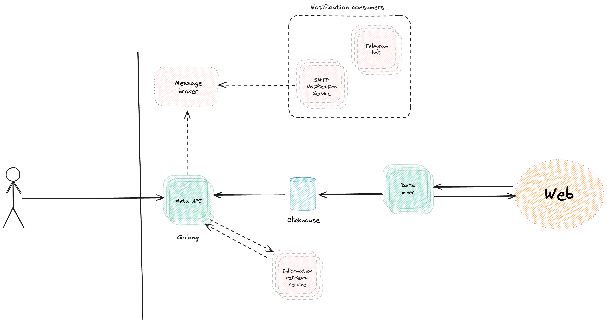
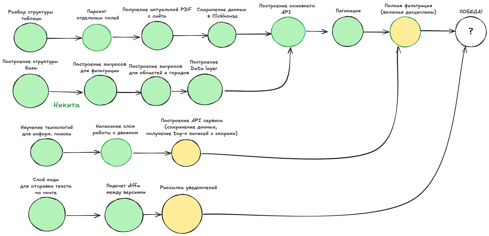

# zero-cost developers

## Общая идея

Сервис на Python тянет данные из PDF, парсит их и сохраняем в Clickhouse.

При получении запроса от клиентская часть приложения создаёт запрос к Clickhouse и возвращает результат.

Вся логика фильтрации реализована через формирование динамического запроса к представлению в Clickhouse.

### Фильтрация по грязным данным

Так как PDF может содержать некоторые грязные данные, то при фильтрации по грязным данным необходимо обрабатывать их как текст.

Для этого планируется индексировать текст о дисциплинах и соревнованиях и выдавать наиболее релевантные результаты.

## Архитектура

## Текущее состояние проекта

